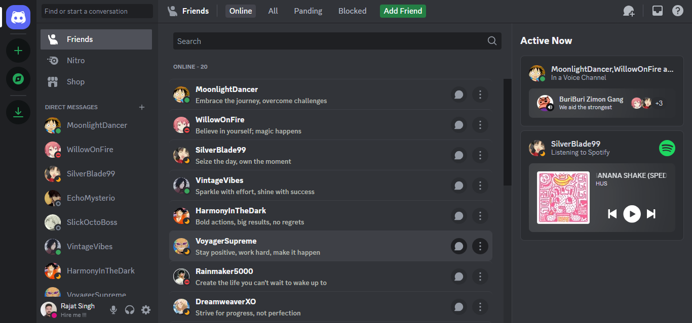
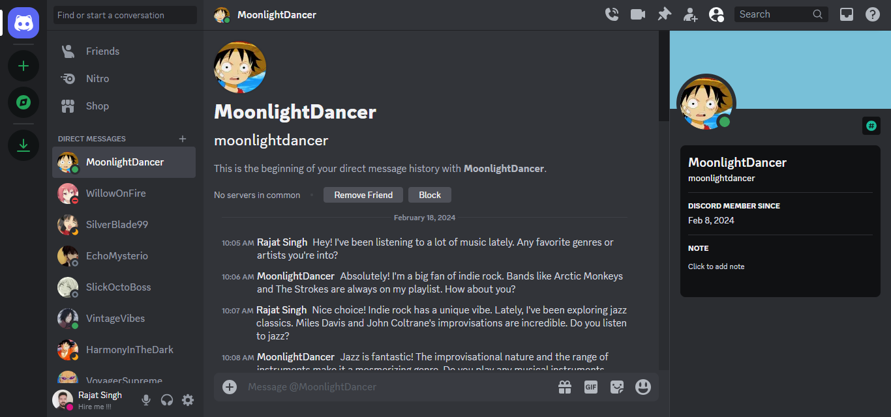

# Rizzcord 

## Welcome to Rizzcord! 🌟

Rizzcord isn't your typical Discord UI clone—it's a playground where frontend creativity knows no bounds! Crafted with love and finesse, Rizzcord elevates your Discord experience with enhanced user interfaces and captivating animations. It's time to level up your web experience with Rizzcord!

## Features ✨

Get ready to be wowed by Rizzcord's standout features:

- Elevate your Discord experience with a sleek and intuitive interface.
- Immerse yourself in a world of dynamic animations that breathe life into every interaction.
- Seamlessly navigate across devices with responsive design that adapts to your screen size.

## Take a Peek 👀

Behold the beauty of Rizzcord in action:

_Get a glimpse of Rizzcord's stunning UI._

## Experience it Live 🚀

Don't just take our word for it—see Rizzcord in action yourself! Visit the live demo <a href="https://rizzcord-five.vercel.app/" target="_blank">Rizzcord</a> and prepare to be amazed.

## Technologies Behind the Magic 🛠️

Rizzcord is powered by cutting-edge technologies that make your web experience truly magical:

1. **Next.js**: For lightning-fast performance and seamless navigation.
2. **Framer Motion**: Bringing your UI to life with captivating animations.
3. **Tailwind CSS**: Crafting beautiful, responsive designs with ease.
4. **Recoil**: State management made simple, so you can focus on what matters—building amazing experiences.

## Join the Fun 🎉

Feeling inspired? We'd love to have you join us on this journey! While we're not accepting contributions at the moment, your feedback and suggestions are always welcome.

## Give a Star ⭐

If you find Rizzcord exciting and useful, why not show your appreciation by giving it a star on GitHub? Your support means the world to us and helps spread the word about Rizzcord's awesomeness!
